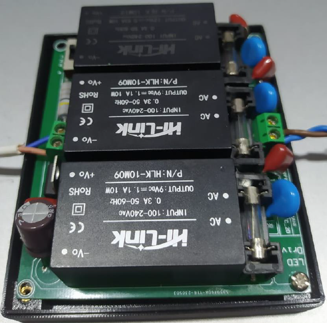

# LED-Driver
## Project description

The Universal LED driver is a project done in our 4th semester as DIY project. It mainly focuses on creating a LED driver which can be operated in three different watt ranges.

  

It consists of two major circuits;
- AC-DC converter with regulated DC voltage output
- Constant current source

The LED driver can be connected to the AC power supply and the circuit is mounted into a 3D enclosure which was created using Solidworks.

## Features
- Three different watt ranges to be operated, which can be chosen using a switch
- Can be used to give the desired DC voltage and current output
